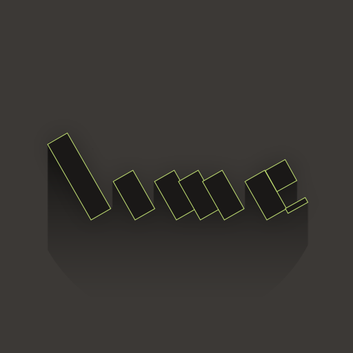

Introduction
============

Lime (Light Media Engine) is an abstraction layer that makes it simple to go cross-platform with only one codebase; without the compromise of relying upon a scripting language or a virtual machine.

Lime leverages the power of the [Haxe](http://haxe.org/) programming language, compiling directly to C++, JavaScript and other target languages. Haxe is a flexible, robust language, and the resulting applications are truly native. Lime provides the tools and the backend to seamlessly support many platforms.

Platforms
=========

Lime currently supports the following platforms:

 * Windows
 * Mac
 * Linux
 * iOS
 * Android
 * BlackBerry
 * Tizen
 * Emscripten
 * HTML5

With legacy support for:

 * webOS
 * Flash

What It Does
============

Lime exposes the following:

 * OpenGL
 * Audio
 * Input
 * Windowing
 * Useful native features
 
By setting up a bootstrap for your application, Lime will handle all of the low-level events, and call into your main class (this can be overridden) for you.

The rendering API is very similar to WebGL, which in turn is similar to OpenGL ES. This enables us to support your code on platforms using OpenGL, OpenGL ES and WebGL. 

How It Works
============

Lime comes together in three different parts.

The **first** are [command-line tools](https://github.com/openfl/lime-tools), which manage the build, package, install and run process for each support platform.

The **second** is the native layer, which handles rendering, sound and other features with hand-written C++ (with a small amount of Objective-C and Java) in order to handle the core of each platform. This layer is not used when targeting HTML5. You can find this in the repository under "project"

The **third** is a Haxe wrapper (under development), which exposes this functionality and helps abstract differences (such as HTML5 vs. native builds). The Lime wrapper itself does not support Flash, but frameworks above Lime can add support (such as [OpenFL](https://github.com/openfl/openfl))

Lime is designed to power higher-level frameworks, in addition to exposing a sensible cross-platform API for "more direct" development. Most popularly, Lime is also used as the foundation for [OpenFL](https://github.com/openfl/openfl) which is an open-source, accelerated version of the Flash API, supporting all of the Lime targets as well as an HTML5 canvas implementation of the API as well.

License
=======

Lime is free, open-source software under the [MIT license](LICENSE.md).

Installing Lime
===============

First you will need to first install Haxe 3.0 for [Windows](http://haxe.org/file/haxe-3.0.0-win.exe), [Mac](http://haxe.org/file/haxe-3.0.0-osx-installer.dmg) or [Linux](http://www.openfl.org/download_file/view/726/12426/).

Once Haxe has been installed, you can install a release version of Lime from a terminal or command-prompt with these commands:

    haxelib install lime
    haxelib run lime setup

Some platforms will require some additional setup before you can use them. For example, you must have Visual Studio C++ in order to build native applications for Windows. Lime includes a "setup" command that can help you walk through the process for each target:

    lime setup windows
    lime setup android
    lime setup blackberry
    lime setup tizen
    lime setup emscripten
    lime setup webos

In order to build for Mac or iOS, you should already have a recent version of Xcode installed. In order to build for Linux, usually only g++ is required, which may be installed with your distribution already. No setup is required for these platforms.

Development Builds
==================

If you would like to begin using Lime directly from the repository, or want to help contribute to its development, you will first want to clone the repository (or your fork of the repository) then tell "haxelib" where your development version is installed. You will also need to clone [lime-build](https://github.com/openfl/lime-build), which includes static libraries and headers required to recompile the Lime native layer from the source.

    git clone https://github.com/openfl/lime
    haxelib dev lime lime
    git clone https://github.com/openfl/lime-build
    haxelib dev lime-build lime-build

The "lime/ndll" directory will be empty, but you can easily rebuild the binaries for any platform using "lime rebuild", like:

    lime rebuild windows
    lime rebuild windows,blackberry
    lime rebuild linux -64
    lime rebuild android -debug

Most platforms do not require additional dependencies (other than usual dependencies) to rebuild, but if you are running linux you will development libraries for GL and GLU, as well as multilib versions of g++ if you plan to rebuild both 32- and 64-bit versions of the Lime native layer (which is done through "rebuild" by default)

    sudo apt-get install libgl1-mesa-dev libglu1-mesa-dev g++ g++-multilib gcc-multilib

By default, "rebuild" will compile every binary needed for a target, including both release and debug, and for certain platforms, multiple architectures (such as x86 for an emulator or arm for a device). You can use "-debug", "-release", "-64" and "-32" to specify that you only want to rebuild one kind of binary, and you can use commas to separate multiple builds, in the same command.

There is also a helpful "-rebuild" flag you can use, that rebuilds only the required Lime binary, in addition to the meaning of the original command. For example, the following will test the current application, rebuilding the Windows release binary for Lime first:

    lime test windows -rebuild
    
To return to release builds of Lime, use:

    haxelib dev lime
    
Usually, you will _not_ need to use development versions of the Lime command-line tools as well, but if you would like, you can find instructions at the [lime-tools](https://github.com/openfl/lime-tools) repository.

Using Lime
==========

If you prefer a low-level API, you may want to use Lime directly. The Lime 1.0 wrapper is still under development, you can see the wiki for the 1.0 [roadmap](https://github.com/openfl/lime/wiki/lime-wrapper-1.0-Roadmap).

You can get a taste by trying the "SimpleOpenGL" or "HerokuShaders" samples:

    lime create lime:SimpleOpenGL
    cd SimpleOpenGL
    lime test linux

You can substitute "HerokuShaders" for "SimpleOpenGL" in the above command, or use "lime create" to see all available samples. The "test" command combines "update", "build" and "run" into one step. If you are not running Linux, or would like to use a different target, you can try one of the following as well:

    lime test windows
    lime test mac
    lime test ios
    lime test ios -simulator
    lime test android
    lime test android -emulator
    lime test blackberry
    lime test blackberry -simulator
    lime test tizen
    lime test tizen -simulator
    lime test emscripten
    lime test html5
    lime test webos
    lime test webos -simulator

If you do not prefer a low-level API, [OpenFL](https://github.com/openfl/openfl) is currently the easiest way to use Lime. Instead of making direct OpenGL calls, OpenFL uses a much simpler (but powerful) API, on top of the functionality of Lime. For example, in order to display an image, OpenFL would use:

    var bitmap = new Bitmap (Assets.getBitmapData ("image.png"));
    addChild (bitmap);

This is far fewer steps than using OpenGL directly, so you should decide what level of API you prefer. Even if you are not familiar with the Flash API, OpenFL should be easy-to-use.
